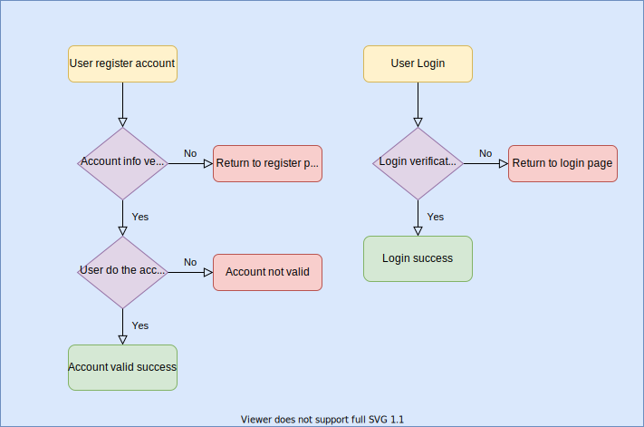

# RestAPI_Layout

[](https://www.travis-ci.com/yeejiac/WebAPI_layout)

## Features

- RestAPI structure
- Connect with Redis
- Simple login verification layout
- Session & cookies expiration setting
- User register
- Account verify by sending verification letter

## Executions

- compile and execute
```
$ make build
$ ./build/build
```

- run 
```
make run
```

- docker start
```
docker-compose up
```

- docker stop
```
docker-compose down
```

## Flowchart

